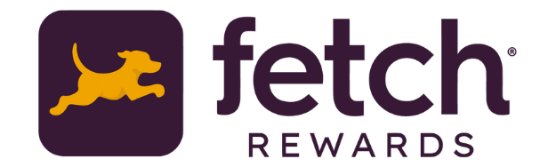
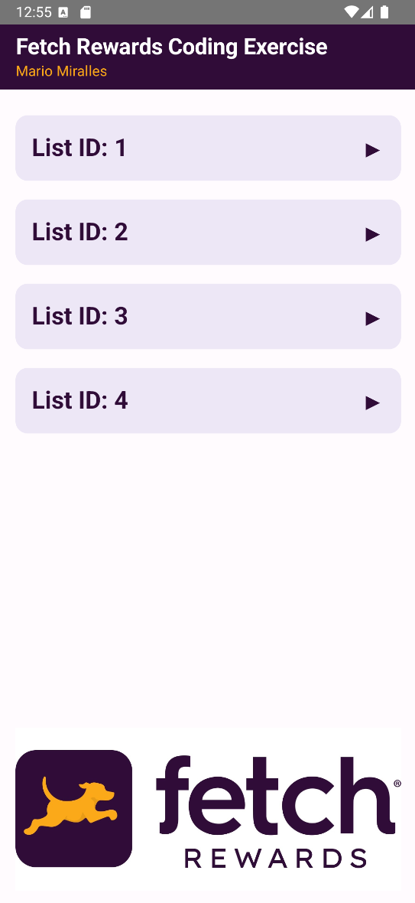
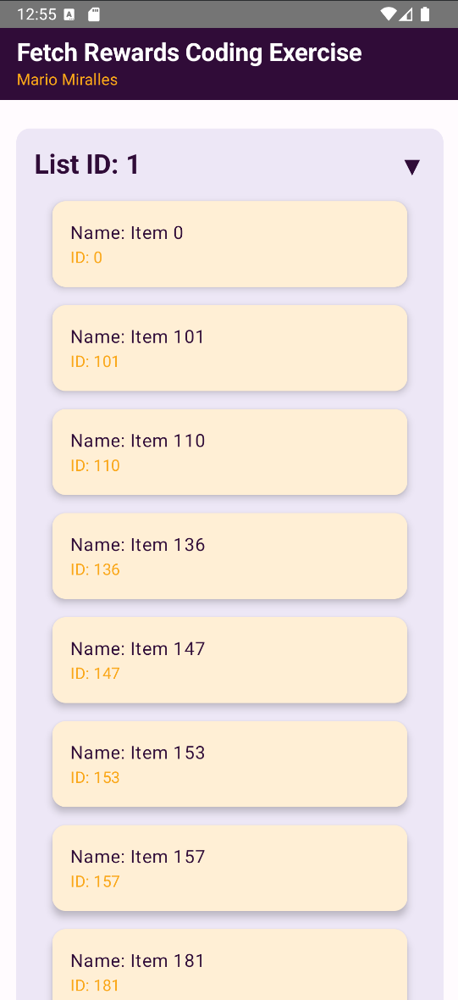

<div align="center">
  
</div>


# Coding Exercise - Software Engineering - Mobile

Android Engineer, Apprenticeship test submission for **Mario Miralles**.


This project demonstrates a mobile app built with Kotlin, Android Studio, and Jetpack Compose. It showcases a list of items fetched from a remote API, with custom styling for a polished user experience.
## Tech Stack

**Kotlin:** Programming language used for app development.

**Android Studio:** IDE used for development.

**Jetpack Compose:** UI toolkit for building modern Android UIs.


## Features

- Dynamic Data Loading: Fetches and displays a list of items from a remote API.
- Custom UI Styling: Incorporates a purple and orange color scheme.
- Expandable List Groups: Allows users to expand and view details of grouped items.
- Footer Image: Displays a branded footer image at the bottom of the screen.


## Installation

1. Clone the repository:

```bash
  git clone https://github.com/MarioMiralles/fetch-coding-exercise.git
```
2. Open the project in **Android Studio**.
3. Build and run the app on an emulator or physical device.
## Screenshots

<div style="display: flex; gap: 3rem;">
  
  
</div>


## 🚀 About Me
👋 Hi I’m Mario and I'm thrilled to apply for this Apprenticeship opportunity at Fetch. As a Full-Stack Software Engineer, I’m driven by my passion for engineering and continuous learning. This project has reinforced my love for tackling technical challenges and leveraging my adaptability to create a solution.

Working with Kotlin, Android Studio, and Jetpack Compose on this project allowed me to further refine my skills and gain invaluable insights into integrating innovative technologies. I’m excited to bring this level of enthusiasm and dedication to Fetch, where I hope to contribute meaningfully and grow alongside your talented team.

Thank you for considering my application. I look forward to the possibility of discussing how I can bring my passion and experience to your team!

[](https://www.linkedin.com/in/mariofmiralles)
